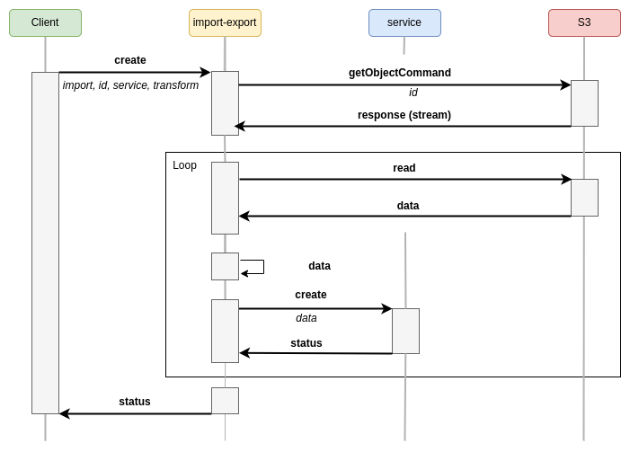
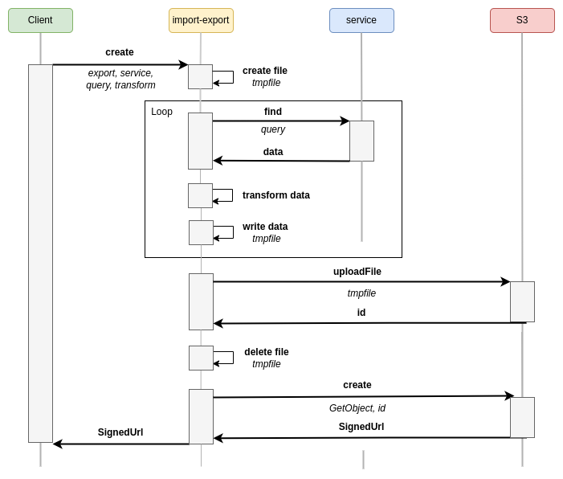

# feathers-import-export

[](https://github.com/kalisio/feathers-import-export/releases)
[](https://app.travis-ci.com/kalisio/feathers-import-export)
[](https://codeclimate.com/github/kalisio/feathers-import-export)
[](https://codeclimate.com/github/kalisio/feathers-import-export/coverage)
[](https://www.npmjs.com/package/@kalisio/feathers-import-export)

> `feathers-import-export` provides convenient methods to import/export to/from FeathersJS services.


`feathers-import-export` has been specially designed to process large volumes of data and to overcome data transfer problems during import and export, it relies on the capabilities of the S3 API. Thus the use is based on the use of a store which offers an **S3 compatible API**.

> NOTE
>
> To deals with the objects in the stores, `feathers-import-export` relies on the [feathers-s3](https://github.com/kalisio/feathers-s3) library.


## Principle

The following sections illustrate the different process implemented by `feathers-import-export`:

### Import



### Export



## Usage

### Installation

```shell
npm install @kalisio/feathers-import-export --save
```

or

```shell
yarn add @kalisio/feathers-import-export
```

### Example

## API

`feathers-import-export` consists in a single service that provides the following methods:

### constructor (app, options)

Create an instance of the service with the given options:

| Parameter | Description | Required |
|---|---|---|
|`s3ServicePath` | the path to the s3Service to be retrieved from the `app`. | yes |
| `workingDir` | the working directory to process temporary files. Default value is `/tmp` | no |


### registerTransform (key, transform)

Register a transformation function for the given key.

| Parameter | Description | Required |
|---|---|---|
|`key` | the key assigend to the transformation function. | yes |
| `transform` | the transformation function. | yes |

### create (data, params)

Shortcut method that calls [import](#import) or [export](#export) according the value of the `method` property.

The payload `data` must contain the following properties:

| Argument | Description | Required |
|---|---|---|
| `method` | the method to call, either `ìmport` or `export`. | yes |

Concerning the other properties, refer to the description of the different methods.

### import (data, params)

Imports the content of a file that is stored on a **S3** compatible storage.

The payload `data` must contain the following properties:

| Argument | Description | Required |
|---|---|---|
| `id` | the object key. Note that the final computed **Key** takes into account the `prefix` option of the service. | yes |
| `servicePath` | the path to the service into which to import the data. | yes |
| `transform`| the [transformation](./#transformation) to apply before importing the data. Defaut is `undefined` | no |

### export (data, params)

Exports the result of a query into a **JSON**, **CSV** or **GeoJson** file that it stored on an **S3** compatbile storage. The file can be compressed using [GZip](https://www.gzip.org/).
By default It returns a **Presigned URL** to the file.

The payload `data` must contain the following properties:

| Argument | Description | Required 
|---|---|---|
| `servicePath` | the path to the service to be queried.| yes |
| `query` | the query to apply. Default value is `{}` | no |
| `chunkPath`| the path to the data when processing the query response. Default value is `data` | no |
| `chunkSize` | the number of objects to be processed by chunk. Defaut value is `500` | no |
| `transform`| the [transformation](./#transformation) to apply before expoting the data. Defaut is `undefined` | no |
| `format` | the output format. Defaut value is `json` | no |
| `zip`| whether to zip the output or not. Default value is `true` | no |
| `signedUrl` | whether to return a signed url. Default value is `true` | no |
| `expiresIn` | the expiration delay of the returned signed url. Default value is `300` | no |

> WARNING
>
> The `chunkSize` must be less than the `max` property of the `paginate` options assigned to the service.

## Transformation

As illustrated in the previous sections, `feathers-import-export` allows you to apply a **transformation** before importing or exporting the data.

The transformation can be carried out via a **transform** object or via un function.

### Transform object

The **transform** object can be declared with the following specifications:

* `toArray`: boolean indicating if the JSON object will be transformed into an array using Lodash (opens new window), defaults to false
* `toObjects`: if your input JSON objects are flat arrays it will be transformed into objects according to the given indexed list of property names to be used as keys, not defined by default
* `filter`: a filter to be applied on the JSON object using any option supported by [sift](https://github.com/crcn/sift.js)
* `mapping`: a map between input key path and output key path supporting dot notation, the values of the map can also be a structure like this:
  * `path`: output key path
  * `value`: a map between input values and output values
  * `delete`: boolean indicating if the input key path should be deleted or not after mapping
* `unitMapping`: a map between input key path supporting dot notation and from/to units to convert using math.js (opens new window)for numbers or moment.js (opens new window)for dates, a value of the map is a structure like this:
  * `from`: the unit or date format to convert from, e.g. feet or YYYY-MM-DD HH:mm:ss.SSS
  * `to`: the unit or date format to convert to, e.g. m or MM-DD-YYYY HH:mm:ss.SSS, if given for a date the date object will be converted back to string
  * `asDate`: mandatory to indicate if the value is a date, could be utc or local to interpret it as UTC or Local Time
asString: mandatory to convert numbers to strings, indicates the radix (opens new window)to be used if any
  * `asNumber`: mandatory to convert strings to numbers
  * `asCase`: target case to be used as the name of a Lodash (opens new window)(e.g. lowerCase) or JS string (opens new window)(e.g. toUpperCase) case conversion function (e.g. lowerCase)
  * `empty`: value to be set if the input value is empty
* `pick`: an array of properties to be picked using Lodash(opens new window)
* `omit`: an array of properties to be omitted using Lodash(opens new window)
merge: an object to be merged with each JSON objects using Lodash(opens new window)
* `asObject`: this boolean indicates if the output should be transformed into an object if the array contains a single object, defaults to false
* `asArray`: this boolean indicates if the output should be transformed into an array containing the object, defaults to false.

```js
transform: {
  toArray: true, // The following input object { 1: { property: 'a' }, 2: { property: 'b' } } will be transformed into [{ property: 'a' }, { property: 'b' }]
  toObjects: ['1', '2'], // The following input object ['a', 'b'] will be transformed into { 1: 'a', 2: 'b' }
  mapping: {
    sourceProperty: 'targetProperty',
    sourceProperty: {
      path: 'targetProperty',
      values: {
        'a': 'c' // Will map { xxx: 'a' } to { yyy: 'c' }
      }
    },
    'source.property': 'target.property',
    sourceProperty: 'targetArrayProperty[0]'
  },
  unitMapping: {
    property: { from: 'feet', to: 'm' } // This one will be converted from feet to meters
  },
  pick: ['onlyThisPropertyWillBeKept'],
  omit: ['onlyThisPropertyWillBeRemoved'],
  merge: { newProperty: 'will be added to the final objects' }
}
```

> TIP
>
> The transformations are applied in the order of the documentation, e.g. filtering occurs before mapping.

### Transform function

The transformation function must be [registered](#registertransform-key-transform) in the service.

The function must have the following signature: `function myTrasnform (chunk)` where `chunk` represents an array of JSON objects.

```js
function myTrasnform (chunk) {
  chunk.forEach(object => {
    // mutate object
  })
  return chunk
}
```
To specify the transformation function within the **import** or **export** payload, you must declare assign to the `transform` property the **key** used to register the function

Assuming you have register the function `myTransform` with the key `my-transform`, then you can declare the transformation function as below:

```js
transform: 'my-transform'
```

## License

Copyright (c) 2017-20xx Kalisio

Licensed under the [MIT license](LICENSE).

## Authors

This project is sponsored by 

[](https://kalisio.com)
