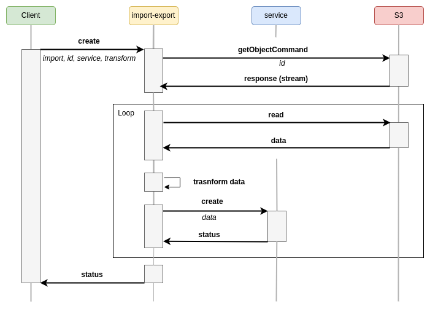

# feathers-import-export

[](https://github.com/kalisio/feathers-import-export/releases)
[](https://github.com/kalisio/feathers-import-export/actions/workflows/main.yaml)
[](https://codeclimate.com/github/kalisio/feathers-import-export)
[](https://codeclimate.com/github/kalisio/feathers-import-export/coverage)
[](https://opensource.org/licenses/MIT)
[](https://www.npmjs.com/package/@kalisio/feathers-import-export)

> `feathers-import-export` provides convenient methods to import/export to/from [Feathers services](https://feathersjs.com/api/services.html).

`feathers-import-export` has been specially designed to process large volumes of data and to overcome data transfer problems during import and export, it relies on the capabilities of the S3 API. 

> [!WARNING]
> Consequently, the use of this library requires being able to operate a store compatible with the **S3 API**.

> [!NOTE]
> To deal with the objects in the stores, `feathers-import-export` relies on the [feathers-s3](https://github.com/kalisio/feathers-s3) library. It is highly recommended to read a little more about this library upfront.

## Principle

The following sections illustrate the different processes implemented by `feathers-import-export`:

### Import



### Export


## Usage

### Installation

```shell
npm install @kalisio/feathers-import-export --save
```

or

```shell
yarn add @kalisio/feathers-import-export
```

### Example

#### Setup the service

Assuming you have setup a Feathers app:

```js
// Import Feathers stufff
import { Service } from '@kalisio/feathers-import-export'

// Setup Feathers app

const options = {
  s3Options: {
    s3Client: {
      credentials: {
        accessKeyId: process.env.S3_ACCESS_KEY_ID,
        secretAccessKey: process.env.S3_SECRET_ACCESS_KEY
      },
      endpoint: process.env.S3_ENDPOINT,
      region: process.env.S3_REGION,
      signatureVersion: 'v4'
    },
    bucket: process.env.S3_BUCKET,
    prefix: 'tmp' // a folder used to store imported/exporter files
  },
  app,
  workingDir: process.env.TMP_DIR,
}

app.use('import-export', new Service(options))
```

The `s3Options` options are described in [feathers-s3](https://github.com/kalisio/feathers-s3#constructor-options)

#### Import data from a file

Import data from a `data.csv` file into the `my-service` service:

```js
const response = await app.service('import-export').create({
  method: 'import',
  id: 'key/to/the/file/in/the/bucket'   // file key into the bucket
  servicePath: 'path/to/service'        // path to the service where to import the data
})
```

> [!NOTE]
> This method assumes that you have already uploaded the file.

#### Export data to a file

Export data from the `my-service` service into the `data.csv` file:

```js
const response = await app.service('import-export').create({
  method: 'export',
  servicePath: 'path/to/my-service',
  filename: 'data.csv',
  format: 'csv'
})
```

## API

`feathers-import-export` consists in a single service that provides the following methods:

### constructor (app, options)

Create an instance of the service with the given options:

| Parameter | Description | Required |
|---|---|---|
|`s3Options` | the options to configure the S3 service. Refer to [feathers-s3](https://github.com/kalisio/feathers-s3#constructor-options) API. | yes |
| `app` | the feathers app. | yes |
| `workingDir` | the working directory to process temporary files. Default value is `/tmp`. | no |

### registerTransform (key, transform)

Register a transformation function for the given key.

| Parameter | Description | Required |
|---|---|---|
|`key` | the key assigned to the transformation function. | yes |
| `transform` | the transformation function. | yes |

### create (data, params)

Shortcut method that calls [import](#import) or [export](#export) according the value of the `method` property.

The payload `data` must contain the following properties:

| Argument | Description | Required |
|---|---|---|
| `method` | the method to call, either `import` or `export`. | yes |

Concerning the other properties, refer to the description of the different methods.

### import (data, params)

Imports the content of a file that is stored on a **S3** compatible storage.

The payload `data` must contain the following properties:

| Argument | Description | Required |
|---|---|---|
| `id` | the object key. Note that the final computed **key** takes into account the `prefix` option of the service. | yes |
| `servicePath` | the path to the service into which to import the data. | yes |
| `transform`| the [transformation](./#transformation) to apply before importing the data. Default is `undefined` | no |

### export (data, params)

Exports the result of a query into a **JSON**, **CSV** or **GeoJson** file that it stored on an **S3** compatible storage. The file can be archived in [zip]() or [tgz] using [Archiver](https://www.archiverjs.com/).
By default It returns a **Presigned URL** to the file.

The payload `data` must contain the following properties:

| Argument | Description | Required 
|---|---|---|
| `servicePath` | the path to the service to be queried.| yes |
| `query` | the query to apply. Default value is `{}` | no |
| `chunkPath`| the path to the data when processing the query response. Default value is `data` | no |
| `chunkSize` | the number of objects to be processed by chunk. Default value is `500` | no |
| `transform`| the [transformation](./#transformation) to apply before exporting the data. Default is `undefined` | no |
| `format` | the output format. Défaut value is `json` | no |
| `archive`| whether to archive the output or not. It should be `zip`, `tgz` or `undefined`. Default value is `undefined` | no |
| `signedUrl` | whether to return a signed url. Default value is `true` | no |
| `expiresIn` | the expiration delay of the returned signed url. Default value is `300` | no |

> [!WARNING]
> The `chunkSize` must be less than the `max` property of the `paginate` options assigned to the service.

## Transformation

As illustrated in the previous sections, `feathers-import-export` allows you to apply a **transformation** before importing or exporting the data.

The transformation can be carried out via a **transform** object or via a function.

### Transform object

The **transform** object can be declared with the following specifications:

* `toArray`: boolean indicating if the JSON object will be transformed into an array using [Lodash](https://lodash.com/docs#toArray), defaults to false
* `toObjects`: if your input JSON objects are flat arrays it will be transformed into objects according to the given indexed list of property names to be used as keys, not defined by default
* `filter`: a filter to be applied on the JSON object using any option supported by [sift](https://github.com/crcn/sift.js)
* `mapping`: a map between input key path and output key path supporting dot notation, the values of the map can also be a structure like this:
  * `path`: output key path
  * `value`: a map between input values and output values
  * `delete`: boolean indicating if the input key path should be deleted or not after mapping
* `unitMapping`: a map between input key path supporting dot notation and from/to units to convert using [math.js](http://mathjs.org/docs/datatypes/units.html) for numbers or [moment.js](https://momentjs.com/) for dates, a value of the map is a structure like this:
  * `from`: the unit or date format to convert from, e.g. feet or YYYY-MM-DD HH:mm:ss.SSS
  * `to`: the unit or date format to convert to, e.g. m or MM-DD-YYYY HH:mm:ss.SSS, if given for a date the date object will be converted back to string
  * `asDate`: mandatory to indicate if the value is a date, could be utc or local to interpret it as UTC or Local Time
asString: mandatory to convert numbers to strings, indicates the [radix](https://developer.mozilla.org/en-US/docs/Web/JavaScript/Reference/Global_Objects/Number/toString#Syntax) to be used if any
  * `asNumber`: mandatory to convert strings to numbers
  * `asCase`: target case to be used as the name of a [Lodash](https://lodash.com/docs/4.17.15#lowerCase) (e.g. `lowerCase`) or [JS string](https://developer.mozilla.org/fr/docs/Web/JavaScript/Reference/Global_Objects/String) (e.g. toUpperCase) case conversion function (e.g. lowerCase)
  * `empty`: value to be set if the input value is empty
* `pick`: an array of properties to be picked using [Lodash](https://lodash.com/docs#pick)
* `omit`: an array of properties to be omitted using [Lodash](https://lodash.com/docs#omit)
merge: an object to be merged with each JSON objects using [Lodash](https://lodash.com/docs#merge)
* `asObject`: this boolean indicates if the output should be transformed into an object if the array contains a single object, defaults to false
* `asArray`: this boolean indicates if the output should be transformed into an array containing the object, defaults to false.

```js
transform: {
  toArray: true, // The following input object { 1: { property: 'a' }, 2: { property: 'b' } } will be transformed into [{ property: 'a' }, { property: 'b' }]
  toObjects: ['1', '2'], // The following input object ['a', 'b'] will be transformed into { 1: 'a', 2: 'b' }
  mapping: {
    sourceProperty: 'targetProperty',
    sourceProperty: {
      path: 'targetProperty',
      values: {
        'a': 'c' // Will map { xxx: 'a' } to { yyy: 'c' }
      }
    },
    'source.property': 'target.property',
    sourceProperty: 'targetArrayProperty[0]'
  },
  unitMapping: {
    property: { from: 'feet', to: 'm' } // This one will be converted from feet to meters
  },
  pick: ['onlyThisPropertyWillBeKept'],
  omit: ['onlyThisPropertyWillBeRemoved'],
  merge: { newProperty: 'will be added to the final objects' }
}
```

> [!TIP]
> The transformations are applied in the order of the documentation, e.g. filtering occurs before mapping.

### Transform function

The transformation function must be [registered](#registertransform-key-transform) in the service.

The function must have the following signature: `function myTransform (chunk, options)` where 
* `chunk` represents an array of JSON objects.
* `options` represents the options passed to the `import` or `export` methods. It allows you to retrieve some contextual data if needed when processing the chunk.

```js
function myTransform (chunk, options) {
  chunk.forEach(object => {
    // mutate object
  })
  return chunk
}
```

To specify the transformation function within the **import** or **export** payload, you must assign to the `transform` property the **key** used to register the function

Assuming you have registered the `myTransform` function with the `my-transform` key, then you can declare the transformation function as below:

```js
transform: 'my-transform'
```
## Hooks

As mentioned before `feathers-import-export` relies on [feathers-s3](https://github.com/kalisio/feathers-s3), particularly on the methods [getObjectCommand](https://github.com/kalisio/feathers-s3?tab=readme-ov-file#getobjectcommand-data-params) and [uploadFile](https://github.com/kalisio/feathers-s3?tab=readme-ov-file#uploadfile-data-params) which are used respectively by the `import` and `export` methods. Consequently, you have the flexibility to register hooks on these methods to incorporate additional processing steps. For instance, it might be practical to include a before hook on the `uploadFile` method to execute preprocessing on the entire file before transferring it to the storage, such as converting it to another file format.

### Registering hooks

Hooks can be registered by accessing the internal **S3 service**, as demonstrated below:

```js
app.use('path-to-service', new Service(Object.assign(options, { app })))
service = app.service('path-to-service')
service.s3Service.hooks({
  before: {
    uploadFile: [myHook]
  }
})
```
### Predefined hooks

#### convertGeoJson

This hook converts exported **GeoJSON** data to any format using [ogr2ogr](https://gdal.org/programs/ogr2ogr.html). 

To trigger this hook,you must declare the `convertGeoJson` object in the `export` method with the following properties:
* `ogrDriver`: any [Vector driver](https://gdal.org/en/stable/drivers/vector/index.html), e.g. `KML`,
* `contentType`: file mime type; e.g. `application/vnd.google-earth.kml+xml`

For instance: 

```js
convertGeoJson: {
  ogrDriver: 'ESRI Shapefile',
  contentType: 'application/zip'
}
```

> [!NOTE]
> In case of [ESRI Shapefile](https://en.wikipedia.org/wiki/Shapefile) format, you must specify a `filename` with the extension `shp.zip` to force the creation of a compressed archive containing `.shp`, `.shx`, `.dbf` and other side-car files of one or more layers.

#### reprojectGeoJson

This hook allows to reproject the exported **GeoJSON** data to any **Coordinate Reference System** using [ogr2ogr](https://gdal.org/programs/ogr2ogr.html). 

To trigger this hook, you must declare the `reprojectGeoJson` object in the `export` method with the following properties:
* `srs`: any coordinate reference systems, e.g. `EPSG:3857`

For instance: 
```js
reprojectGeoJson: {
  srs: `EPSG:2154`
}
```

> [!NOTE]
> The coordinate reference systems that can be passed are anything supported by the [OGRSpatialReference::SetFromUserInput()](https://gdal.org/en/stable/api/ogrspatialref.html#_CPPv4N19OGRSpatialReference16SetFromUserInputEPKc) call, which includes EPSG Projected, Geographic or Compound CRS (i.e. EPSG:4296), a well known text (WKT) CRS definition, PROJ.4 declarations, or the name of a .prj file containing a WKT CRS definition.

## License

Copyright (c) 2017-20xx Kalisio

Licensed under the [MIT license](LICENSE).

## Authors

This project is sponsored by 

[](https://kalisio.com)
